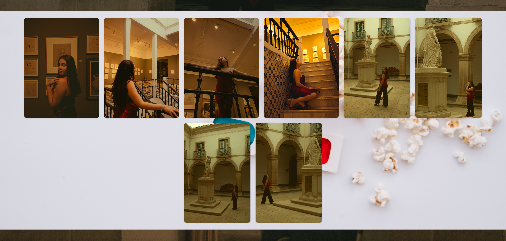
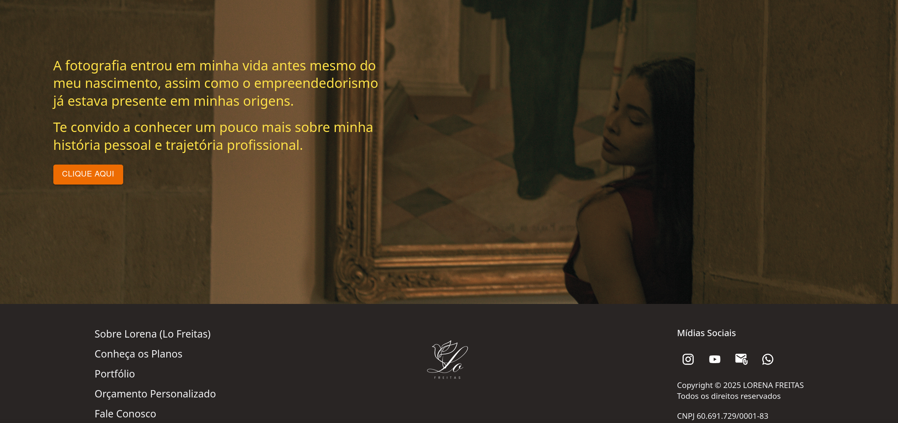
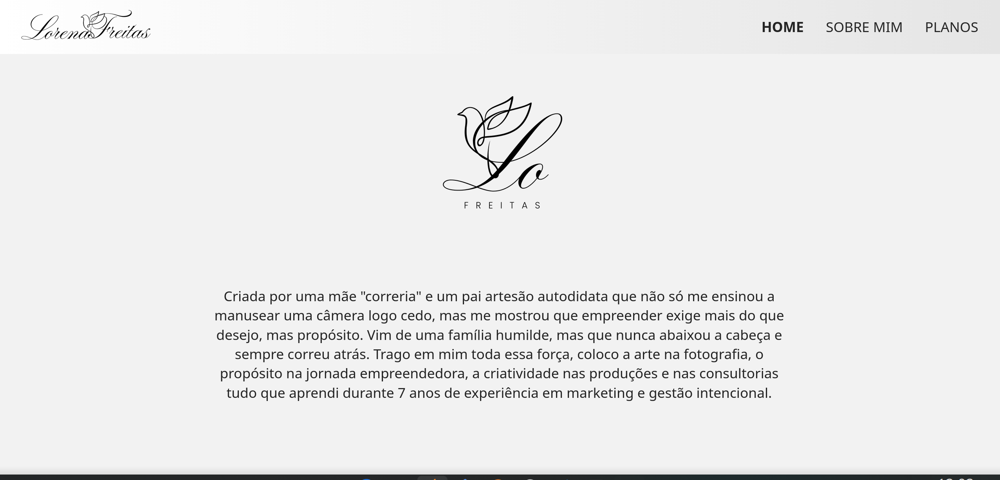

# 📸 Landing Page - Fotógrafa de Salvador

Uma landing page moderna, responsiva e de alta performance desenvolvida para uma fotógrafa da cidade de Salvador - BA.

O objetivo do projeto é apresentar de forma elegante os serviços da profissional, destacar sua identidade visual e facilitar o contato com clientes através das redes sociais.

# 📸 Landing Page - Fotógrafa de Salvador

Uma landing page moderna, responsiva e de alta performance desenvolvida para uma fotógrafa da cidade de Salvador - BA.

<p align="center">
  <a href="https://lorena-landing-page.vercel.app/sobre" target="_blank">
    
  </a>
</p>

O objetivo do projeto é apresentar de forma elegante os serviços da profissional, destacar sua identidade visual e facilitar o contato com clientes através das redes sociais.

---

## 🚀 Tecnologias Utilizadas

- ⚛️ React JS
- ⚡ Vite
- HTML5
- CSS3
- JavaScript (ES6+)

---

# 📖 Funcionalidades

- Página inicial (Home)
- Seção **Sobre Mim**
- Seção **Planos**
- Links para as redes sociais no rodapé
- Layout responsivo
- Navegação fluida entre as seções
- Interface moderna e minimalista

---

# 📷 Preview

## Home 1/3


---

## Home 2/3



---

## Home 3/3



---

## Sobre 1/2



## Sobre 2/2


---

# 📂 Estrutura do Projeto

```text
├── public/
├── src/
│   ├── assets/
│   ├── components/
│   ├── pages/
│   ├── App.jsx
│   └── main.jsx
├── midia/
│   ├── 01.png
│   ├── 02.png
│   ├── 03.png
│   └── 04.png
├── package.json
├── vite.config.js
└── README.md
```

---

# ⚙️ Como executar o projeto

Clone o repositório:

```bash
git clone https://github.com/seu-usuario/nome-do-repositorio.git
```

Entre na pasta do projeto:

```bash
cd nome-do-repositorio
```

Instale as dependências:

```bash
npm install
```

Execute o projeto:

```bash
npm run dev
```

O projeto estará disponível em:

```
http://localhost:5173
```

---

# 🎯 Objetivo

Este projeto foi desenvolvido como uma landing page institucional para apresentar os serviços de uma fotógrafa profissional de Salvador, proporcionando uma experiência agradável para visitantes e potenciais clientes.

---

# 📱 Responsividade

A aplicação foi desenvolvida seguindo o conceito **Mobile First**, oferecendo uma ótima experiência em:

- Smartphones
- Tablets
- Notebooks
- Desktops

---

# 💻 Desenvolvimento

Projeto desenvolvido utilizando React JS e Vite, priorizando:

- Componentização
- Código limpo
- Performance
- Facilidade de manutenção
- Boa experiência do usuário (UX)

---

# 📄 Licença

Este projeto está disponível para fins de demonstração em portfólio.

Caso deseje utilizar este projeto como base, sinta-se à vontade para adaptá-lo conforme sua necessidade.

---

## 👨‍💻 Desenvolvedor

Desenvolvido por **Erik Martins**.

Se gostou do projeto, deixe uma ⭐ no repositório.